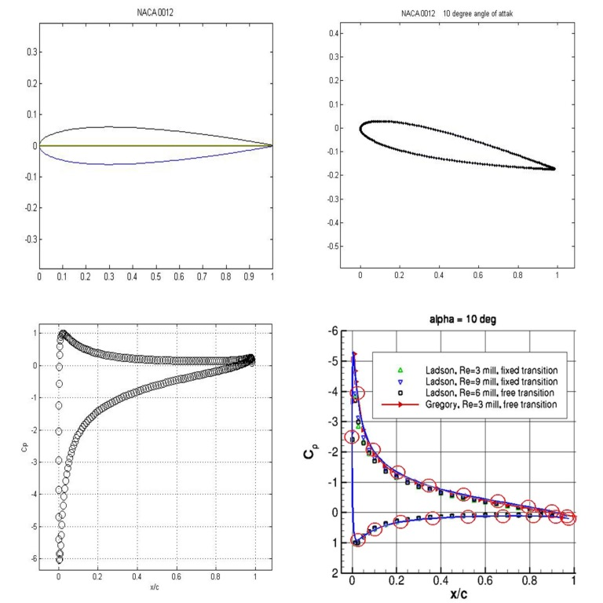

# Aerodynamics simulation applications.

By Mohammad Zandsalimy (mohammad.zandsalimy@ubc.ca)

Some of my previous projects are presented below.

## Vortex Panel Method
This is a program for computing the pressure distribution and lift over NACA 4-digit airfoils in a potential flow field. The airfoil is generated and the geometry is built using potential vortex panels, then the flow field is numerically solved and pressure coefficients on these panels are calculated. The user is free to choose any NACA 4-digit airfoil and angle of attack, but the prediction of flow is valid only at low angles of attack, until the flow detachment occurs. Here we can see a NACA 0012 airfoil at a 10 degree angle of attack analyzed by the code. On the bottom right side plot the predicted pressure coefficients are compared to those in the experiment, the large red  circles are my predictions and there is a very low error.

